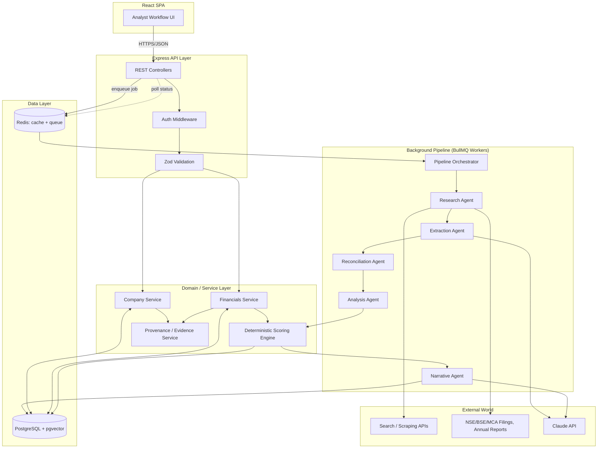
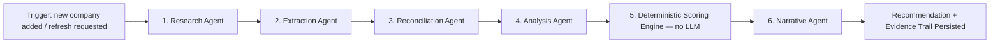
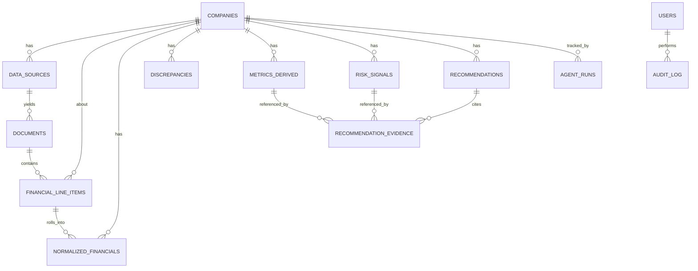
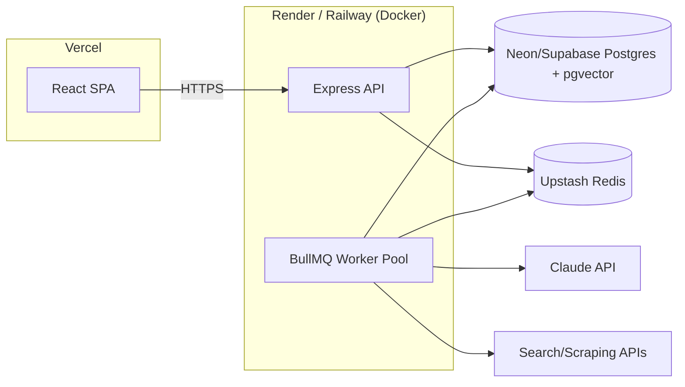

# Credit Intelligence Platform — System Architecture & LLD

**Project:** "Would You Lend Them ₹1 Crore?" — AI-assisted credit intelligence product for a lending analyst
**Stack:** Node.js, Express, React, PostgreSQL, Redis — pure JavaScript
**Doc type:** High-Level Design (HLD) + Low-Level Design (LLD)

This document is written to be dropped straight into the repo as `ARCHITECTURE.md` / referenced from the README. It covers the full system: architecture, AI agent design, data model, API contracts, folder structure, resilience strategy, and how the design maps to the assignment's evaluation criteria and the live technical-round scenarios.

---

## 1. Problem Framing (what the architecture must actually optimize for)

Re-reading the brief, three constraints should drive every architectural decision more than "add more features":

1. **Traceability is the product.** The assignment explicitly says a strong submission lets them trace `Recommendation → Insight → Calculation → Source`. That means the data model has to carry provenance as a first-class citizen, not as an afterthought — every number on screen must be clickable down to the raw source.
2. **The decision logic must be deterministic and explainable, not "ask the LLM."** The brief is explicit: *"the important calculations and decision logic should be understandable and reproducible."* So the architecture puts a hard boundary between the **LLM/agent layer** (research, extraction, summarization, narrative) and the **deterministic rule/scoring engine** (ratios, signals, APPROVE/DECLINE logic). The LLM never silently decides the loan outcome.
3. **The system must survive an ambiguous, changing world.** Conflicting sources, missing data, a data provider going down, the loan amount changing from ₹1cr to ₹20cr mid-review — these are named as literal test scenarios for the live round. The architecture is built so these are *configuration/data* changes, not code rewrites.

Everything below follows from these three constraints.

---

## 2. Design Principles

- **Evidence-first data model.** Nothing is stored as a bare number. Every metric/signal/recommendation links to the source document(s) and the extraction method that produced it.
- **Separation of "gathering intelligence" from "deciding."** Agents (LLM-driven) populate structured, versioned facts. A deterministic scoring engine (plain JS, unit-testable, no LLM in the loop) turns those facts into a recommendation.
- **Confidence is a real field, not a UI decoration.** Every extracted fact and every derived signal carries a confidence score (0–1) and a provenance trail, so uncertainty propagates visibly instead of getting laundered into a false-precision number.
- **Idempotent, replayable pipeline.** Re-running research/extraction for a company produces a new *version* of the analysis, never mutates history in place — so "the latest filing changed the numbers" is a new pipeline run with a diff against the previous version, not a bug.
- **Fail loud, degrade gracefully.** External source failures should downgrade confidence and surface a banner, not crash the pipeline or silently use stale data.
- **Boring, defensible tech choices.** Every piece of the stack is chosen because it's the least surprising option for a fintech decision-support tool that will be explained live to reviewers — not because it's trendy.

---

## 3. Tech Stack

| Layer | Choice | Why |
|---|---|---|
| Frontend | **React 18 + Vite**, plain JavaScript (JSX) | Fast dev loop, matches the "JavaScript" requirement, no build-tool ceremony |
| Data fetching / server state | **TanStack Query** | Caching, retries, background refetch — exactly what a "pipeline status polling" UI needs |
| UI state | **Zustand** | Minimal boilerplate vs Redux for local UI state (filters, drawer open/close) |
| Styling | **Tailwind CSS** + a small design-tokens file | Fast, consistent spacing/typography without a heavy component library fight |
| Charts | **Recharts** (trend lines, ratio charts) | Good enough for financial trend visualization, React-native API |
| Backend runtime | **Node.js (LTS) + Express** | Matches the stated stack, mature ecosystem, easy to reason about for reviewers |
| Validation | **Zod** | Runtime schema validation at every API/agent boundary — this is the project's substitute for TypeScript's compile-time safety |
| ORM | **Prisma** | Type-safe-ish query layer even in JS (via generated client + JSDoc), painless migrations — important for a schema that will evolve (new signal types, new data sources) |
| Primary database | **PostgreSQL** | Financial/lending data is inherently relational (company → filings → line items → metrics → signals → recommendation) and needs ACID guarantees and JSON columns (`jsonb`) for flexible provenance/evidence payloads. This beats MongoDB here because discrepancy detection and evidence joins are natural SQL joins, and Postgres's `jsonb` gives document-store flexibility where it's actually needed (raw extracted payloads). |
| Vector search | **pgvector extension on the same Postgres instance** | RAG over filings/annual reports for the extraction agent, without standing up a separate vector DB — one less moving part to explain in the review |
| Cache / queue broker | **Redis** | Cache external API responses & LLM calls (cost + rate-limit control), backs the job queue |
| Background jobs | **BullMQ** (Redis-based) | The research→extraction→analysis pipeline is slow (seconds to minutes) and must run off the request thread, be retryable, and be observable per-stage |
| LLM provider | **Claude (Anthropic API)**, model-agnostic via an adapter | Strong at long-document extraction and structured reasoning; adapter layer means the model can be swapped without touching agent logic |
| Agent orchestration | **Custom lightweight state-machine orchestrator** (not a heavy framework) | The pipeline is a fixed DAG (research → extract → reconcile → analyze → score → narrate). A small hand-rolled orchestrator is easier to explain and debug live than a black-box framework — and every step logs to `agent_runs` for replay |
| Web research / scraping | **Search API (e.g. Tavily/Serper) + Cheerio/Playwright for targeted fetches** | Company filings, exchange announcements, and news aren't behind one clean API — a research agent needs both search and targeted scraping |
| Auth | **JWT (short-lived access + refresh token)**, `bcrypt` password hashing | Simple, standard, no need for a session store beyond Redis |
| Testing | **Vitest/Jest** (backend logic, especially the scoring engine) + **Playwright** (e2e on the analyst workflow) | The scoring engine is the highest-stakes code in the app — it needs the heaviest unit test coverage |
| Observability | **Pino** (structured logs) + a simple `agent_runs`/`audit_log` table doubling as an app-level trace store | Enough to explain "why did it decide this" in a live review without standing up a full observability stack |
| Deployment | Frontend: **Vercel**. Backend + workers: **Render/Railway** (Docker). DB: **Neon/Supabase Postgres** (has pgvector). Redis: **Upstash**. | All have generous free tiers, zero-ops, and support the "deployed URL" deliverable requirement directly |
| CI/CD | **GitHub Actions** — lint, test, build, deploy on merge to `main` | Standard, verifiable in the repo |

---

## 4. High-Level Architecture



**Layer responsibilities:**

- **Client** — analyst-facing SPA. Never talks to the LLM or external sources directly; only to the Express API.
- **API layer** — thin. Auth, validation (Zod), rate limiting, request→service delegation. No business logic here.
- **Domain/service layer** — the "brains" that are *not* AI: company CRUD, financial data access, and — most importantly — the **deterministic scoring engine** (§7), which is plain, testable JavaScript.
- **Background pipeline** — everything AI-driven and slow lives here, off the request/response cycle, coordinated by a small orchestrator that persists every step (§5).
- **Data layer** — Postgres is the single source of truth; Redis is purely cache + queue, never authoritative.

---

## 5. AI Agent Architecture

### 5.1 Why a pipeline of narrow agents, not one big "analyze this company" prompt

A single mega-prompt can't be traced, retried per-stage, or partially re-run when one filing changes. Splitting into narrow agents with typed inputs/outputs gives per-stage retries, per-stage caching, per-stage confidence, and — critically — a debuggable trail for the live technical round ("why did the system say this").



| Stage | Type | Responsibility | Output |
|---|---|---|---|
| **1. Research Agent** | LLM + tools (search, fetch) | Given a company name/ticker, finds candidate sources: latest annual report, quarterly results, exchange filings/announcements, credible news. Scores each source's trustworthiness (regulator/exchange > audited filing > company IR page > news > blog). | List of `data_sources` rows with `trust_score` |
| **2. Extraction Agent** | LLM (structured output via JSON schema) + RAG over fetched documents (pgvector) | Pulls specific line items (revenue, EBITDA, debt, cash flow from ops, receivables, etc.) from each source, **with page/section citation**. Never invents a number — if not found, returns `null` with a reason. | `financial_line_items` rows, each with `source_id`, `confidence`, `raw_snippet` |
| **3. Reconciliation Agent** | Deterministic code + LLM assist for judgment calls | Groups line items by metric+period across sources. Where sources agree within tolerance → merges. Where they disagree beyond tolerance → creates a `discrepancies` row instead of silently picking one. | `discrepancies` rows + `normalized_financials` for agreed values |
| **4. Analysis Agent** | Deterministic code (ratios) + LLM (signal *labeling*, not scoring) | Computes derived metrics (ratios, growth rates, trend deltas) with plain formulas, then asks the LLM only to help *describe/label* borderline patterns in plain English (e.g. "flag this as a working-capital signal") | `metrics_derived`, candidate `risk_signals` |
| **5. Scoring Engine** | **Pure deterministic JS — no LLM call** | Applies the rule-based decision matrix (§7) to metrics + signals + confidence + discrepancies to produce APPROVE / APPROVE_WITH_CONDITIONS / DECLINE with a numeric confidence. | `recommendations` row |
| **6. Narrative Agent** | LLM | Turns the *already-decided* recommendation + its evidence into a readable analyst narrative ("Why we recommend this"). It explains a decision that was already made deterministically — it cannot change the decision. | `recommendation_narrative` text, linked to evidence |

This is the single most important architectural decision in the system, worth stating explicitly in the README and in the live review: **the LLM researches, reads, and explains; a small, unit-tested, deterministic module decides.** That directly answers the brief's "AI Judgement: using AI effectively without creating a black box" evaluation criterion.

### 5.2 Orchestrator

- A lightweight `PipelineOrchestrator` (plain Node class, not a framework) runs the 6 stages as a BullMQ job chain.
- Every stage writes a row to `agent_runs` (input snapshot, output snapshot, model, tokens, latency, status) *before* moving on — this is what lets a reviewer replay exactly what the system saw and decided at each stage.
- Stage failures don't fail the whole run: e.g. if the Research Agent can't find a source, the pipeline proceeds with lower overall confidence and a visible gap, rather than aborting.
- Each stage is individually resumable — if "extraction" fails for one document, only that stage is retried (BullMQ retry with exponential backoff), not the whole pipeline.

### 5.3 Guardrails on the LLM layer

- All LLM calls that produce structured data use JSON-schema-constrained output, validated with Zod on receipt; a failed validation triggers one retry with the validation error fed back to the model, then falls back to `null`/low-confidence rather than a guessed value.
- Every LLM call is logged (prompt hash, model, token count, latency, cost) for cost tracking and auditability.
- Prompts explicitly instruct: "cite the source location for every number; return `null` rather than estimate."
- The Narrative Agent is given the finished, already-computed recommendation object as context — it is structurally incapable of overriding the number, only describing it.

---

## 6. Data Model (LLD)



### 6.1 Core tables

```sql
-- Company being evaluated
companies (
  id UUID PK,
  name TEXT NOT NULL,
  ticker TEXT,
  isin TEXT,
  cin TEXT,                    -- MCA Corporate Identification Number
  sector TEXT,
  exchange TEXT,                -- NSE / BSE
  created_by UUID REFERENCES users(id),
  created_at TIMESTAMPTZ DEFAULT now()
);

-- Every source the research agent found, with a trust rating
data_sources (
  id UUID PK,
  company_id UUID REFERENCES companies(id),
  source_type TEXT CHECK (source_type IN
     ('exchange_filing','annual_report','quarterly_result',
      'regulatory_data','news','company_announcement','other')),
  title TEXT,
  url TEXT,
  publisher TEXT,
  published_at DATE,
  trust_score NUMERIC(3,2),     -- 0.00–1.00, set by Research Agent rubric
  fetched_at TIMESTAMPTZ DEFAULT now(),
  raw_storage_ref TEXT          -- pointer to raw HTML/PDF blob in object storage
);

-- Parsed document metadata (a source may yield one or more documents, e.g. a
-- filing PDF split into statements)
documents (
  id UUID PK,
  source_id UUID REFERENCES data_sources(id),
  doc_type TEXT,                 -- balance_sheet / pnl / cash_flow / notes / announcement
  period_label TEXT,             -- e.g. "FY2025 Q4", "FY2024"
  period_end DATE,
  parse_status TEXT CHECK (parse_status IN ('pending','parsed','failed')),
  embedding_indexed BOOLEAN DEFAULT false  -- true once chunked into pgvector
);

-- Every individual extracted number, always tied to where it came from
financial_line_items (
  id UUID PK,
  company_id UUID REFERENCES companies(id),
  document_id UUID REFERENCES documents(id),
  statement_type TEXT,           -- balance_sheet / pnl / cash_flow
  line_item TEXT,                 -- canonical key e.g. 'total_debt', 'ebitda'
  period_end DATE,
  value NUMERIC,
  unit TEXT DEFAULT 'INR_CR',
  extracted_by TEXT DEFAULT 'ai_extraction_agent',
  confidence NUMERIC(3,2),
  source_snippet TEXT,            -- the exact quoted text the value came from
  page_reference TEXT,
  created_at TIMESTAMPTZ DEFAULT now()
);

-- Where two+ sources disagree on the same metric/period beyond tolerance
discrepancies (
  id UUID PK,
  company_id UUID REFERENCES companies(id),
  metric_key TEXT,
  period_end DATE,
  line_item_a UUID REFERENCES financial_line_items(id),
  line_item_b UUID REFERENCES financial_line_items(id),
  value_a NUMERIC, value_b NUMERIC,
  delta_pct NUMERIC,
  resolution_strategy TEXT,       -- 'prefer_higher_trust_source' | 'average' | 'manual' | 'unresolved'
  resolved_value NUMERIC,
  resolved_confidence NUMERIC(3,2),
  status TEXT DEFAULT 'open' CHECK (status IN ('open','resolved','flagged_for_analyst'))
);

-- One row per metric per period after reconciliation — this is what the
-- Analysis Agent and Scoring Engine actually read from
normalized_financials (
  id UUID PK,
  company_id UUID REFERENCES companies(id),
  period_end DATE,
  metric_key TEXT,                -- 'revenue','ebitda','total_debt','cash_from_ops',...
  value NUMERIC,
  confidence NUMERIC(3,2),
  source_line_item_ids UUID[],    -- provenance: which line items rolled into this
  UNIQUE(company_id, period_end, metric_key)
);

-- Computed ratios/trends, always with the formula + inputs stored
metrics_derived (
  id UUID PK,
  company_id UUID REFERENCES companies(id),
  period_end DATE,
  metric_name TEXT,                -- 'interest_coverage_ratio','dscr','current_ratio',...
  value NUMERIC,
  formula TEXT,                    -- human-readable formula for the UI tooltip
  inputs JSONB,                    -- {"ebit": 120, "interest_expense": 30, ...}
  trend TEXT CHECK (trend IN ('improving','stable','deteriorating', NULL))
);

-- Named risk/opportunity signals (needs >= 3 meaningful ones per the brief)
risk_signals (
  id UUID PK,
  company_id UUID REFERENCES companies(id),
  signal_key TEXT,                  -- 'profit_cash_divergence','rising_receivable_days', etc.
  severity TEXT CHECK (severity IN ('low','medium','high')),
  direction TEXT CHECK (direction IN ('risk','opportunity')),
  description TEXT,
  evidence_metric_ids UUID[],
  confidence NUMERIC(3,2),
  detected_at TIMESTAMPTZ DEFAULT now()
);

-- The final answer
recommendations (
  id UUID PK,
  company_id UUID REFERENCES companies(id),
  loan_amount_requested NUMERIC,     -- parameterized, not hardcoded to 1cr
  decision TEXT CHECK (decision IN ('APPROVE','APPROVE_WITH_CONDITIONS','DECLINE')),
  overall_confidence NUMERIC(3,2),
  score_breakdown JSONB,              -- full scoring engine trace (see §7)
  narrative TEXT,                     -- LLM-authored explanation of the deterministic result
  pipeline_run_id UUID REFERENCES agent_runs(id),
  version INT,                        -- increments on re-run (filing update, amount change, etc.)
  generated_at TIMESTAMPTZ DEFAULT now()
);

-- Explicit join: which signals/metrics were cited for this recommendation
recommendation_evidence (
  id UUID PK,
  recommendation_id UUID REFERENCES recommendations(id),
  evidence_type TEXT CHECK (evidence_type IN ('metric','signal','discrepancy')),
  evidence_id UUID,
  weight NUMERIC,
  note TEXT
);

-- One row per pipeline stage execution — the debuggability backbone
agent_runs (
  id UUID PK,
  company_id UUID REFERENCES companies(id),
  stage TEXT,                        -- research/extraction/reconciliation/analysis/scoring/narrative
  status TEXT CHECK (status IN ('running','succeeded','failed','retried')),
  input_snapshot JSONB,
  output_snapshot JSONB,
  model_used TEXT,
  tokens_used INT,
  latency_ms INT,
  error TEXT,
  started_at TIMESTAMPTZ,
  completed_at TIMESTAMPTZ
);

users ( id UUID PK, name TEXT, email TEXT UNIQUE, password_hash TEXT,
        role TEXT CHECK (role IN ('analyst','admin')), created_at TIMESTAMPTZ DEFAULT now() );

audit_log ( id UUID PK, user_id UUID REFERENCES users(id), action TEXT,
            entity TEXT, entity_id UUID, metadata JSONB, created_at TIMESTAMPTZ DEFAULT now() );
```

`document_chunks(id, document_id, chunk_text, embedding VECTOR(1536))` is a companion table (pgvector) used only by the Extraction Agent for RAG lookups — not analyst-facing.

### 6.2 Why this shape

- **Provenance is structural, not a comment.** `financial_line_items → normalized_financials → metrics_derived → risk_signals → recommendation_evidence → recommendations` is a literal foreign-key chain. The "click a number, see its source" UI feature (§10) is just a join down this chain, not a separate bolted-on audit system.
- **Discrepancies are modeled, not resolved-and-forgotten.** The `discrepancies` table is exactly the ₹420cr-vs-₹463cr scenario from the brief — it's a queryable, displayable entity, not something silently averaged away in code.
- **Versioned recommendations.** A new filing or a changed loan amount produces a new `recommendations` row (`version` incremented), so the analyst — and the live-review panel — can diff "what changed and why," which is directly one of the named live-round scenarios.

---

## 7. Decision Methodology — the Deterministic Scoring Engine (LLD)

This is a plain JavaScript module (`src/domain/scoring/`), independently unit-tested, with **zero LLM calls**. It's the part of the system that must be "understandable and reproducible."

### 7.1 Metrics used (minimum set)

| Category | Metrics |
|---|---|
| Profitability | Revenue growth (YoY), EBITDA margin trend |
| Leverage | Debt/Equity, Interest Coverage Ratio, Debt/EBITDA |
| Liquidity | Current Ratio, Quick Ratio |
| Cash quality | Cash Conversion (CFO / EBITDA) — catches "profit growing but cash deteriorating" |
| Working capital | Receivable Days trend, Payable Days trend, Working Capital / Revenue trend |
| Debt-service capacity | **DSCR** (Debt Service Coverage Ratio) — computed *against the requested loan amount*, so this ratio literally changes when the loan amount changes from ₹1cr to ₹20cr |

### 7.2 Signal rules (examples — pluggable, each rule is an isolated function)

```js
// src/domain/scoring/signals/profitCashDivergence.js
export function detectProfitCashDivergence(series) {
  const profitTrend = trendOf(series.map(p => p.netProfit));
  const cfoTrend = trendOf(series.map(p => p.cashFromOps));
  if (profitTrend === 'improving' && cfoTrend !== 'improving') {
    return {
      key: 'profit_cash_divergence',
      severity: 'high',
      direction: 'risk',
      description: 'Profit is growing but operating cash generation is not keeping pace — earnings quality concern.',
    };
  }
  return null;
}
```

Each rule is a small, independently testable function of `(financialSeries, loanContext) => Signal | null`. The Analysis stage runs the full rule set (≥8 implemented so that "at least 3 meaningful signals" is comfortably met on real data) and the LLM is only used to add a plain-English gloss to *already-detected* signals, never to invent them.

### 7.3 Decision matrix

```js
// src/domain/scoring/decisionEngine.js
export function scoreLoanApplication({ metrics, signals, discrepancies, loanAmount }) {
  const weighted = weightSignals(signals);            // severity + confidence weighted sum
  const leverageScore = scoreLeverage(metrics, loanAmount);
  const liquidityScore = scoreLiquidity(metrics);
  const dscrScore = scoreDSCR(metrics, loanAmount);    // ties directly to requested amount
  const dataQualityPenalty = scoreDataQuality(discrepancies, metrics); // more open/unresolved discrepancies -> lower confidence

  const compositeScore = combine({ weighted, leverageScore, liquidityScore, dscrScore }, WEIGHTS);
  const decision = toDecision(compositeScore, dataQualityPenalty); // thresholds -> APPROVE / CONDITIONS / DECLINE
  const overallConfidence = clamp(baseConfidence(metrics) - dataQualityPenalty, 0, 1);

  return {
    decision,
    overallConfidence,
    scoreBreakdown: { weighted, leverageScore, liquidityScore, dscrScore, dataQualityPenalty, compositeScore },
  };
}
```

- **Every intermediate number in `scoreBreakdown` is persisted** in `recommendations.score_breakdown` (JSONB) — so the UI's "Recommendation → Insight → Calculation → Source" trace literally renders this object plus its linked evidence rows. Nothing is recomputed differently for display vs. for the decision.
- Thresholds (`WEIGHTS`, cutoffs) live in a single config file (`src/domain/scoring/config.js`), not scattered — this is what a reviewer will ask to see and tweak live ("what if we require a higher DSCR").
- **Low data quality → confidence penalty, not a fabricated score.** If key metrics are missing or unresolved discrepancies exist, `dataQualityPenalty` pulls confidence down and can force the decision toward `APPROVE_WITH_CONDITIONS` or block a clean `APPROVE`, directly implementing "do not pretend uncertain information is certain."

### 7.4 Conflicting-data resolution algorithm

```
for each (metric, period) with >1 source value:
  if |value_a - value_b| / max(value_a, value_b) <= TOLERANCE (e.g. 2%):
      → auto-merge, take higher-trust source, confidence = min(conf_a, conf_b)
  else:
      → create `discrepancies` row, status = 'open'
      → normalized_financials value = higher-trust source's value,
        but confidence is capped low (e.g. 0.4) and flagged in UI
      → analyst can override the resolution manually (audit-logged)
```

---

## 8. Backend Architecture (LLD)

### 8.1 Layering

```
Request → Route → Controller → Zod validation → Service → Repository (Prisma) → Postgres
                                              ↳ Domain modules (scoring engine, signal rules) — pure, no DB access
Background: Job → Worker → Agent → LLM adapter / external fetchers → Repository → Postgres
```

### 8.2 Folder structure

```
backend/
├── src/
│   ├── config/               # env, db, redis, llm-provider config
│   ├── modules/
│   │   ├── companies/        # controller, service, repository, routes, schema (zod)
│   │   ├── financials/
│   │   ├── signals/
│   │   ├── discrepancies/
│   │   ├── recommendations/
│   │   ├── auth/
│   │   └── agentRuns/        # exposes trace/debug endpoints
│   ├── domain/
│   │   └── scoring/          # PURE, LLM-free: decisionEngine.js, signals/*.js, config.js, __tests__/
│   ├── pipeline/
│   │   ├── orchestrator.js
│   │   ├── agents/
│   │   │   ├── researchAgent.js
│   │   │   ├── extractionAgent.js
│   │   │   ├── reconciliationAgent.js
│   │   │   ├── analysisAgent.js
│   │   │   └── narrativeAgent.js
│   │   ├── llm/               # provider adapter, prompt templates, JSON-schema validators
│   │   └── jobs/               # BullMQ queue + worker definitions
│   ├── infra/
│   │   ├── externalApis/       # search client, filing fetchers, retry/circuit-breaker wrappers
│   │   ├── cache/               # redis cache helpers (get-or-set, TTL policies)
│   │   └── storage/              # raw document blob storage
│   ├── middleware/              # auth, rateLimiter, errorHandler, requestLogger
│   ├── common/                   # logger (pino), errors, utils
│   └── app.js / server.js
├── prisma/
│   ├── schema.prisma
│   └── migrations/
├── tests/
└── Dockerfile
```

### 8.3 Resilience patterns

- **Circuit breaker + exponential backoff** around every external fetch (`infra/externalApis`) — if a primary data provider is down, the breaker opens, the Research Agent automatically falls back to secondary sources, and confidence is marked down rather than the pipeline failing outright. This directly answers the "primary data provider becomes unavailable" live-round scenario.
- **Caching policy:** raw fetched documents cached in object storage indefinitely (immutable once fetched); LLM extraction results cached by `(document hash, prompt version)` in Redis so re-running a pipeline doesn't re-pay for unchanged documents; computed metrics are cheap so not cached, always recomputed from `normalized_financials`.
- **Rate limiting:** both inbound (Express middleware, per-user) and outbound (a token-bucket wrapper around the LLM/search clients so bursts of pipeline runs don't blow through provider rate limits).
- **Idempotent job keys:** a pipeline run is keyed by `(company_id, trigger_reason)`; duplicate triggers within a debounce window are coalesced.

---

## 9. API Contract (LLD)

| Method | Endpoint | Purpose |
|---|---|---|
| `POST` | `/api/auth/login` | Analyst login → JWT |
| `POST` | `/api/companies` | Add a company by name/ticker → enqueues pipeline run |
| `GET` | `/api/companies/:id` | Company summary (latest recommendation + headline metrics) |
| `GET` | `/api/companies/:id/pipeline-status` | Poll current run's per-stage status (from `agent_runs`) |
| `POST` | `/api/companies/:id/refresh` | Re-trigger pipeline (e.g. new filing available) — creates new version |
| `GET` | `/api/companies/:id/financials?period=` | Normalized financial statements |
| `GET` | `/api/companies/:id/metrics` | Derived ratios + trends |
| `GET` | `/api/companies/:id/signals` | Risk/opportunity signals |
| `GET` | `/api/companies/:id/discrepancies` | Open + resolved conflicts, with both source values |
| `PATCH` | `/api/discrepancies/:id/resolve` | Analyst manually resolves a discrepancy (audit-logged) |
| `GET` | `/api/companies/:id/recommendation` | Latest recommendation + full evidence trail |
| `GET` | `/api/companies/:id/recommendation?version=` | A specific historical version (for diffing) |
| `POST` | `/api/companies/:id/recommendation/simulate` | **Re-score only** with a different `loanAmount`, without re-running research — powers the "loan amount changes to ₹20cr" scenario cheaply |
| `GET` | `/api/evidence/:type/:id/source` | Drill down from a metric/signal to its underlying source document + snippet |
| `GET` | `/api/agent-runs/:pipelineRunId` | Full per-stage trace for debugging (reviewer-facing) |

All list responses follow `{ data, meta: { confidence, lastUpdated } }`; all error responses follow a single `{ error: { code, message, details } }` shape produced by a central error-handling middleware.

---

## 10. Frontend Architecture (LLD)

### 10.1 Information architecture (mirrors the brief's own framing exactly)

```
Company Search / Add
        │
        ▼
Company Overview  →  Financial Health  →  Risks & Signals  →  Evidence  →  Lending Decision
   (header, KPIs)     (statements,          (signal cards,      (source        (APPROVE/
                        ratio trends)         severity)          drill-down)    CONDITIONS/DECLINE
                                                                                  + full rationale)
```

Building the UI around exactly this chain (rather than a generic "dashboard") is a deliberate product decision — it makes the tool read as a workflow an analyst follows, not a BI dashboard, which is explicitly what the brief says *not* to build.

### 10.2 Folder structure

```
frontend/
├── src/
│   ├── pages/
│   │   ├── CompanySearchPage.jsx
│   │   ├── CompanyOverviewPage.jsx        # entry point after add/select
│   │   ├── FinancialHealthTab.jsx
│   │   ├── RisksTab.jsx
│   │   ├── EvidenceDrawer.jsx             # slide-over, opened from any number
│   │   └── RecommendationPage.jsx         # decision + full trace + narrative
│   ├── features/
│   │   ├── pipelineStatus/                # polling banner, per-stage progress
│   │   ├── discrepancyReview/             # conflicting-data UI + resolve action
│   │   └── loanSimulator/                 # "what if the loan amount changes" widget
│   ├── components/
│   │   ├── ui/                            # buttons, badges, cards (design system primitives)
│   │   ├── ConfidenceBadge.jsx
│   │   ├── SourceCitation.jsx
│   │   ├── MetricTrendChart.jsx
│   │   └── DecisionMatrixExplainer.jsx    # renders score_breakdown JSON as a readable trace
│   ├── api/                               # typed (JSDoc) API client, one file per resource
│   ├── store/                             # zustand stores (ui-only state)
│   ├── hooks/                             # useCompany, usePipelineStatus, useRecommendation (TanStack Query)
│   └── app/                               # router, layout, providers
```

### 10.3 UI states that are treated as first-class (not an afterthought)

- **Loading** — pipeline in progress: per-stage progress bar (research → extraction → ... ), not a generic spinner, since a run can take 1–3 minutes.
- **Partial data** — some stages succeeded, some didn't: sections render with a visible "incomplete" badge instead of blocking the whole page.
- **Conflicting data** — a dedicated banner/badge wherever a metric feeding the view has an open discrepancy, linking straight to the discrepancy view.
- **Empty** — no company analyzed yet → guided "add a company" state.
- **Error** — external source/LLM failure surfaced with what failed and what the system fell back to, not a generic toast.

---

## 11. Provenance & Explainability Chain (end to end)

This is the feature the assignment cares about most, so it's worth stating as one coherent path:

1. Analyst opens **Recommendation** page → sees `APPROVE WITH CONDITIONS`, confidence 0.72.
2. Clicks "why" → `DecisionMatrixExplainer` renders `score_breakdown` (leverage score, DSCR score, signal weight, data-quality penalty) — all pulled straight from the persisted JSONB, not recomputed.
3. Each component links to `recommendation_evidence` rows → the specific `risk_signals` / `metrics_derived` that fed it.
4. Clicking a signal (e.g. "profit/cash divergence") opens `metrics_derived.inputs` → the exact ratio calculation.
5. Clicking a metric opens `SourceCitation` → the `financial_line_items` row(s) behind it, including the source document, page reference, and quoted snippet.
6. If that metric had a discrepancy, the analyst sees both source values and the resolution strategy applied.

Every hop in that chain is a direct foreign-key traversal — there is no separate "explainability layer" bolted on top; it falls out of the schema in §6.

---

## 12. Security & Auth

- JWT access tokens (15 min) + refresh tokens (7 days, rotated, stored hashed in Redis).
- `bcrypt` for password hashing, `helmet` for HTTP headers, `express-rate-limit` for brute-force protection on auth routes.
- Role-based access (`analyst` vs `admin`) — only `admin` can manage users; both can run analyses.
- All external API keys (LLM, search) server-side only, never exposed to the client.
- Every mutating action (resolve discrepancy, re-trigger pipeline, override recommendation) is written to `audit_log` — expected in a lending context.
- Input validation via Zod on every mutating endpoint; Prisma parameterizes all queries (no raw SQL injection surface).

---

## 13. Deployment Architecture



- Single `docker-compose.yml` for local dev spins up Postgres + Redis + API + worker together.
- GitHub Actions pipeline: `lint → unit tests (scoring engine gets 100% branch coverage target) → build → deploy`.
- Environment separation via `.env` per environment; secrets injected via the hosting platform's secret manager, never committed.

---

## 14. Scalability Notes (right-sized, not over-engineered)

This is an analyst tool, not a high-throughput consumer app, so scaling decisions are deliberately modest:

- The pipeline is I/O-bound (LLM + external fetch latency dominates), so **horizontal worker scaling** (more BullMQ worker processes) is the lever that matters, not database sharding.
- Postgres read load stays low because the frontend reads mostly-static, already-computed rows (`normalized_financials`, `metrics_derived`) rather than recomputing on every request.
- Indices: `(company_id, period_end)` on all time-series tables, `(company_id, status)` on `discrepancies`, `(metric_key)` on `normalized_financials`.
- If this had to support many companies analyzed concurrently, the next step is simply more worker replicas + Redis-backed distributed rate limiting on the LLM/search clients — no architectural change needed.

---

## 15. Designed for the Live Technical Round

The brief names four example scenarios for the live round. Each maps to a specific piece of this architecture rather than requiring new code:

| Scenario | How this architecture handles it |
|---|---|
| "The latest quarterly filing changes the company's financial position" | `POST /companies/:id/refresh` re-triggers the pipeline; new `financial_line_items` + a new `recommendations.version`; UI can diff versions. No manual data surgery needed. |
| "Two sources now disagree about an important metric" | This is a *first-class entity* (`discrepancies` table), not an edge case — it already renders as its own reviewable UI state. |
| "Your primary data provider becomes unavailable" | Circuit breaker in `infra/externalApis` trips, Research Agent falls back to secondary sources, confidence is marked down, pipeline still completes. |
| "The loan amount changes from ₹1 crore to ₹20 crore" | `loanAmount` is a parameter into the scoring engine (DSCR, leverage thresholds all scale with it), exposed via `POST /recommendation/simulate` — re-scoring is instant and doesn't require re-running research/extraction. |

Being able to point at a specific table, endpoint, or module for each of these — live, on request — is the actual goal of this document.

---

## 16. Evaluation Criteria Alignment

| Area (from brief) | Where this architecture addresses it |
|---|---|
| Problem Solving | Explicit separation of "gather intelligence" (ambiguous, agentic) vs. "decide" (deterministic) — the core structural answer to an ambiguous problem |
| Financial Reasoning | §7 metric set + signal rules chosen specifically to surface *relationships* (profit vs. cash, debt vs. earnings growth), not just raw ratios |
| Research | Research Agent with source trust scoring (§5.1) + explicit citation requirement in every extracted fact |
| Product Thinking | UI built around the brief's own `Company → Financial health → Risks → Evidence → Decision` flow, not a generic dashboard (§10.1) |
| Full-Stack Engineering | Layered backend, typed contracts (Zod), tested scoring engine, real job queue for long-running work, proper error/empty/loading states |
| Data & Reliability | Discrepancy modeling, confidence propagation, circuit breakers, versioned recommendations (§6, §7.4, §8.3) |
| AI Judgement | Hard boundary between LLM agents and the deterministic decision engine; every AI call logged and replayable via `agent_runs` (§5.3) |

---

## 17. Suggested Build Order (fits the 12–20 hour recommended effort)

1. **Schema + scoring engine first** (2–3 hrs) — get `domain/scoring` fully unit-tested against fabricated fixture data before any UI or AI exists. This de-risks the highest-stakes part early and works offline.
2. **One company, manual data entry, working end-to-end** (2–3 hrs) — company → metrics → signals → recommendation → evidence trail, all UI states, but with hand-entered `financial_line_items`. Proves the product shape.
3. **Research + Extraction agents for one real company** (3–4 hrs) — wire up real source fetching and LLM extraction for a single chosen company; get the provenance chain working with real data.
4. **Reconciliation + discrepancy UI** (1–2 hrs) — can be tested by deliberately feeding two conflicting sources.
5. **Pipeline orchestration, job queue, status polling UI** (2–3 hrs).
6. **Narrative agent + polish + deploy** (2–3 hrs).
7. **README, architecture doc, assumptions/limitations** (1 hr) — don't skip; it's an explicit deliverable.

Deliberately *not* on this list: multi-company comparison views, user management UI beyond basic login, elaborate theming — the brief explicitly rewards a focused, well-built product over a large dashboard with superficial breadth.

---

## 18. Assumptions & Known Limitations (template — fill in with your actual choices)

- **Chosen company:** _(fill in — one publicly listed Indian company)_
- **Primary data sources used:** _(e.g. BSE/NSE filings, company investor-relations annual report PDF, Screener.in for cross-check)_
- **LLM provider/model:** _(e.g. Claude Sonnet via Anthropic API)_
- **Tolerance threshold for auto-merging conflicting values:** _(e.g. 2%)_
- **What isn't handled yet:** multi-company portfolio view, real-time market data streaming, automated periodic re-runs (currently manual "refresh" trigger only), authentication is single-tenant (no org/team model).

---

## 19. As-Built Notes (where the implementation intentionally diverged from this design)

This document was written before implementation, as the up-front design. Building it surfaced a few pragmatic deltas worth stating explicitly rather than silently — this is exactly the kind of "known limitations / key technical decisions" transparency the brief's README deliverable asks for.

- **`companyKey` is a persisted column on `Company`, not an in-memory map.** The first draft of the service layer kept a companyId → source-file mapping in a process-local `Map`. That's a real bug in a horizontally-scaled or restart-prone deployment (the seed script and the API server are different processes) — it was caught during implementation and fixed by adding `companyKey` as a real, unique column, which is what let the seed script and the API agree on which curated research file to use for `refresh` and `simulate`.
- **The research/extraction stages read curated, cited research from `backend/data/<companyKey>.sources.json` instead of live web search + scraping.** The actual company research (choosing KNR Constructions, pulling real FY23–FY26 figures and citations from Screener.in, a Business Standard results report, and identifying the CRISIL rating rationale) was done as its own research pass — exactly as the brief asks — and the results are captured in that file with per-source trust scores and rationale. The Research Agent's job in code is to load that file; swapping in live search/scraping later only touches `researchAgent.js`, nothing downstream. One source (the CRISIL rationale) is deliberately left with zero extracted line items — the automated fetch of that page was blocked, and rather than approximate its figures, the extraction agent leaves it empty and cites the URL for an analyst to open directly. That is the "return null rather than estimate" rule made concrete.
- **The discrepancy shown in the seeded run is a real, not fabricated, period-basis conflict**, not a synthetic cross-source mismatch: KNR's latest reported period (FY2026) is a partial/provisional year, so working-capital-days computed directly against its un-annualised revenue (345 days) diverges sharply from a trend-extrapolated estimate (231 days). This is exactly the "handle uncertainty / incomplete latest-period data" requirement, encountered naturally rather than staged.
- **Pipeline mode defaults to inline execution, with BullMQ/Redis wired as an opt-in.** `PIPELINE_MODE` and `REDIS_URL` in `.env` control this — set `REDIS_URL` to run the same orchestrator through a queue instead. Inline-by-default means the whole system runs with zero extra infrastructure (`docker-compose up postgres` is enough), which matters more for a reviewable submission than for demonstrating queue infrastructure that isn't yet load-bearing at this scale.
- **The Narrative Agent's LLM call is optional and gracefully degrades.** With no `ANTHROPIC_API_KEY` set, `pipeline/llm/adapter.js` falls back to a deterministic, template-based narrative built from the same `scoreBreakdown` and `signals` a real LLM call would have been given — so the product is fully functional and still evidence-grounded without requiring an API key to evaluate.
- **Verification note.** This sandbox's outbound network policy blocks `binaries.prisma.sh` (Prisma's engine-binary CDN), which meant `prisma generate`/`migrate` couldn't be run inside the build environment itself. To compensate: the deterministic scoring engine (the highest-stakes code in the system) was fully unit-tested and verified (25/25 passing, including determinism, loan-amount sensitivity, and confidence-penalty tests, against the real KNR figures); the database schema was hand-translated to SQL and applied against a real local Postgres 16 instance to confirm it is valid; every Prisma query call site was manually cross-checked against `schema.prisma` field-by-field; and the Express app's full route/module wiring was confirmed to import and construct cleanly (a real missing-dependency bug — `pino-pretty` — was caught and fixed this way). The one thing that could not be exercised end-to-end here is the live Prisma Client against Postgres — `npm install && npx prisma generate && npx prisma migrate deploy && npm run db:seed && npm run dev` will do that on any machine with normal internet access (this is a very common, well-trodden path — not expected to surprise).

### One-paragraph summary (for the README's top)

The system splits cleanly into an **AI research/extraction layer** (agents that find, read, and structure fragmented public information about a company, always with source citation) and a **deterministic scoring layer** (a small, independently unit-tested JavaScript module that turns structured financials into an APPROVE/CONDITIONS/DECLINE recommendation). Every number in the product traces back through the database's foreign-key chain to the exact source document it came from, conflicting sources are modeled explicitly rather than silently resolved, and the loan amount is a first-class parameter rather than a hardcoded ₹1 crore — so the system is built to survive exactly the kind of changing, ambiguous scenario the live technical round is designed to test.
